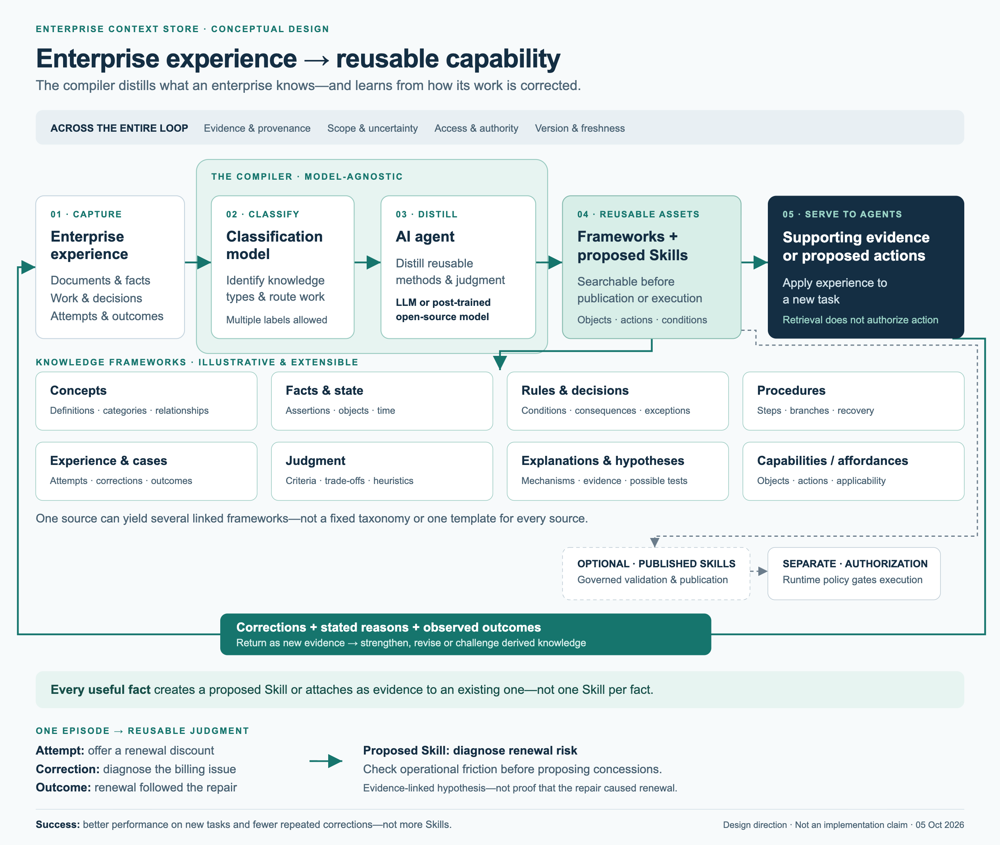
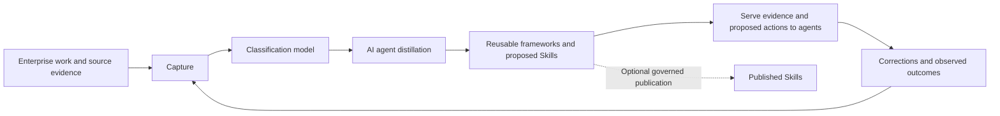

# Enterprise Context Store Framework

## Turn enterprise experience into reusable agent capabilities

An enterprise has more than data. It has ways of diagnosing problems, exceptions that matter,
expert corrections, and lessons from what actually happened. Much of that experience disappears
into conversations, documents, and individual memory.

**Enterprise Context Store (ECS) is a model-agnostic framework for distilling that experience
into reusable knowledge frameworks and searchable proposed Skills that agents can leverage.**

> Summarization compresses information. Distillation makes methods reusable.

**Status: framework and design work, not a production product.** This repository documents the
agreed direction, semantic contracts, research, and open design questions. It does not yet
provide an installable compiler, trained enterprise model, or validated end-to-end deployment.
The benefits below are outcomes to test, not delivered performance claims.

[Latest direction](docs/experience-distillation.md) ·
[Compiler one-pager](docs/assets/compiler-concept.png) ·
[Reference architecture](docs/reference-architecture.md) ·
[Business overview](docs/framework/business-overview.md)



The canonical lifecycle is **Capture → Compile → Serve → Continuous Learning**, with
**Governance & Trust** cross-cutting. The Context Store is the compiled product, not a fifth stage.
Possible AI-agent implementations include an **LLM or post-trained open-source model**;
no provider or training method is required.

**Phase 1 boundary:** public-channel examples; source ACL metadata is recorded, not enforced.
This publication does not authorize private/restricted-channel ingestion or provide operational
security. Authorization requirements describe future implementation obligations.

## What makes the idea useful

- **Learn from work, not just documents.** Capture attempts, expert corrections, stated reasons,
  revised results, and observed outcomes alongside source material.
- **Distill reusable judgment.** Extract concepts, methods, procedures, applicability conditions,
  and possible actions—not merely a shorter version of the source.
- **Make knowledge useful before it becomes automation.** A proposed Skill can be searchable and
  returned as supporting evidence or a proposed action without being published or executable.
- **Keep the evidence attached.** Preserve sources, uncertainty, disagreements, and the
  distinction between expert approval and a demonstrated business outcome.
- **Improve through reuse.** Feed corrections and outcomes back into compilation so experience
  from one task can improve another.

## The experience-to-capability loop



This is the intended conceptual flow, not a deployed architecture. Governance spans the loop;
publication and runtime execution authorization are separate decisions.

The compiler classifies the knowledge present, then an AI agent distills it into appropriate,
linked frameworks. One episode can yield a case, a judgment framework, a procedure, and a
proposed Skill. The framework specifies responsibilities and output boundaries—not a required
model provider, model size, or training technique.

Every useful fact must either create a searchable proposed Skill or attach as supporting or
contradicting evidence to an existing one. Many facts can support one proposal; this does not
require one artifact per fact, publication, or permission to execute.

## A concrete example

*Illustrative synthetic case—not customer data or a measured result.*

An agent recommends a renewal discount. An account manager instead identifies a billing
integration problem. The problem is fixed, and the customer subsequently renews.

ECS should make more than a summary available:

| Output | What it preserves or enables |
|---|---|
| Experience case | The initial recommendation, correction, stated reason if available, repair, and subsequent renewal |
| Judgment framework | Distinguish pricing objections from operational friction when diagnosing renewal risk |
| Proposed Skill | Investigate billing friction before recommending a commercial concession, where applicable |
| Evidence and limitations | This case supports a possible method; it does not prove the repair caused renewal or that discounts never work |

On a later task, an agent could retrieve that proposed Skill as **supporting evidence** or use it
to formulate a **proposed action**. Neither retrieval nor publication grants permission to act.
Current account facts and operational permissions still come from their authoritative systems.

## What ECS is—and is not

| ECS focuses on | ECS does not replace |
|---|---|
| Distilling enterprise experience into reusable capabilities | An agent runtime or agent-management platform |
| Evidence-linked knowledge and proposed methods | Systems of record and their operational facts |
| Agent-facing retrieval and task-specific context | A human-facing knowledge portal |
| Learning from corrections and outcomes | Business authority or runtime authorization |

Knowledge bases and graphs support storage, relationships, and retrieval. They are not, by
themselves, the distillation process. Likewise, an internal compilation bundle can support
reproducibility, but the product value is the reusable understanding delivered to agents.

**The success test:** does experience from one task improve a new task and reduce repeated
correction—without introducing unsupported recommendations or unauthorized disclosure?
Counting generated Skills is not enough.

## Read the design

- [Experience distillation](docs/experience-distillation.md): compiler direction, frameworks, proposed Skills, and future training ideas.
- [Reference architecture](docs/reference-architecture.md): the end-to-end design and boundaries.
- [Semantic contract](docs/context-object-and-retrieval-contract.md): evidence, claims, packages, receipts, and authority.
- [Business overview — for business and technical leaders](docs/framework/business-overview.md)
- [Framework cover page](docs/framework/cover-page.md)
- [Phase 1 framework](docs/framework/phase-1.md)
- [Lifecycle](docs/framework/lifecycle.md) · [Capture](docs/framework/capture.md) · [Compile](docs/framework/compile.md)
- [Accepted decisions](docs/decisions.md) · [Roadmap](docs/roadmap.md) · [Falsification criteria](docs/falsification-criteria.md)

Earlier stage designs retain their historical scope. The latest direction does not claim that
every detailed contract has been revised or implemented. Framework examples are illustrative,
not a fixed taxonomy; research proposals are not adopted components.

## Share the visuals

- Compiler: [PNG](docs/assets/compiler-concept.png) · [PDF](docs/assets/compiler-concept.pdf) · [editable SVG](docs/assets/compiler-concept.svg)
- Architecture: [PNG](docs/assets/reference-architecture.png) · [PDF](docs/assets/reference-architecture.pdf) · [editable SVG](docs/assets/reference-architecture.svg)

Both diagrams describe conceptual responsibilities, not deployed functionality.

## Explore or contribute

```bash
git clone https://github.com/genieyuan/enterprise-context-store-framework.git
cd enterprise-context-store-framework
```

Open an issue or pull request to challenge the framework, propose a synthetic example, or
improve a contract. See [CONTRIBUTING.md](CONTRIBUTING.md). Do not submit credentials,
private conversations, personal information, or customer material.

## License

Documentation and diagrams are [CC BY 4.0](LICENSE-DOCS). Schemas, tests, and tools are
[Apache-2.0](LICENSE-CODE). See [licensing](docs/licensing.md).
