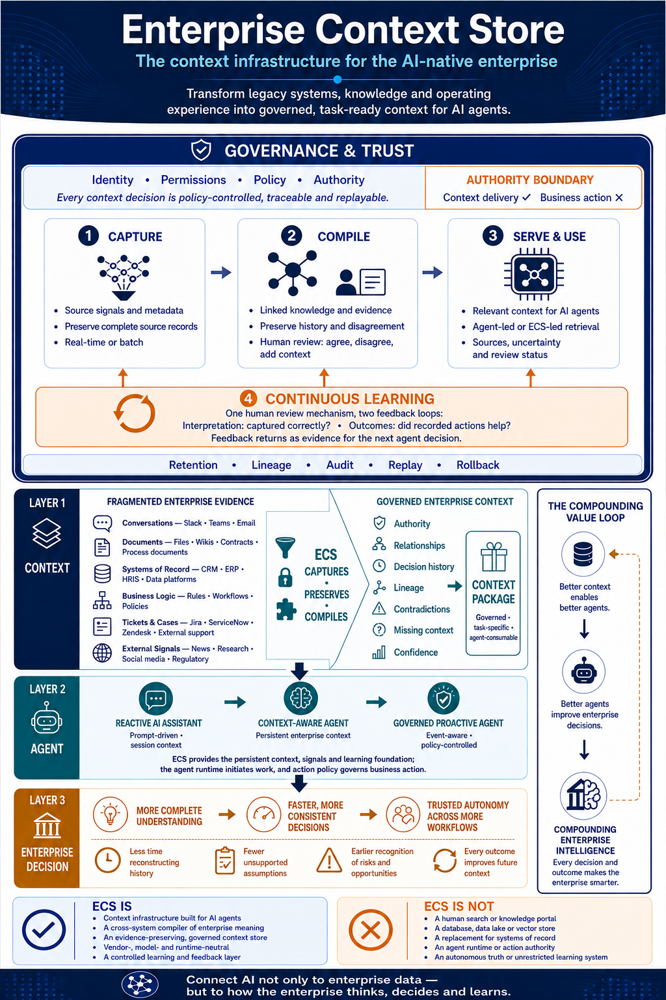

# ECS Framework: Business Overview

*v0.3 · Business overview · About five minutes*

## Executive summary

Your people say AI is saving them hours. But when you look at departmental results, it’s hard to see what has changed.

Meanwhile, each new AI project brings another round of questions for the same business experts. And despite strong data governance, capable data warehouses and accessible, accurate data, AI still makes recommendations that leave experienced employees asking, “Why would we do that?”

These problems can have different causes. One worth examining is whether your AI has access to the records but lacks the context needed to understand them: what was agreed, why an exception exists, what a customer actually cares about, and what happened the last time you tried something similar.

ECS is intended to help make that understanding available to agents. The business opportunity is threefold:

- **From reactive assistance to governed proactive agents.** Instead of people always having to spot the issue, assemble the background and initiate the work, agents can use enterprise context to recognise relevant signals and propose the next action—or act within their authority. The aim is to improve enterprise performance, beyond helping individuals finish tasks faster.
- **From rebuilding understanding for every AI project to reusing what the enterprise already knows.** New initiatives can build on reviewed knowledge, relationships and experience, reducing repeated discovery work, demands on experts, and the time and cost of delivery.
- **From knowledge held by individuals to an enterprise that learns from experience.** Employee perspectives, recorded actions and subsequent outcomes become available to future agents. Lessons can carry forward across teams, projects and changes in personnel.

This takes more than connecting systems. It requires relevant employees to review what AI understood and contribute what it missed. Organisations can start with human-initiated agents and introduce proactive workflows as their capabilities and controls mature.

**This overview explains how ECS works, what participation involves, and how to choose one business workflow where its value can be tested before investing further.**

## What ECS is—and what it isn’t

**Enterprise Context Store (ECS) is a framework for turning enterprise signals and the experience and judgment of individual employees into shared context for AI agents.** It links what people discussed, why decisions were made, which actions followed and what happened afterwards, preserving the evidence and different perspectives behind that understanding.

While your data warehouse and systems of record may show the status of your business, ECS helps agents find the surrounding context: the reasons behind a decision, the commitments people made and the lessons from previous actions. That context helps an agent interpret what the records alone cannot explain.

### ECS is

- Context infrastructure built for agents.
- A compiler of enterprise meaning across systems.
- An evidence-preserving, governed context store.
- Independent of a particular vendor, model or agent runtime.
- A controlled learning and feedback layer.

### ECS isn’t

- A search or knowledge portal for **HUMAN**.
- A database, data lake or vector store.
- A replacement for systems of record.
- An agent runtime or authority to act.
- An autonomous source of truth or unrestricted learning system.

## How the framework works

ECS follows a continuous lifecycle: **Capture → Compile → Serve & Use → Continuous Learning.** It brings enterprise context and external signals together, connects their meaning, makes that knowledge available to agents and incorporates what the enterprise learns from subsequent actions.

**Capture preserves what was produced.** It retains source material and metadata so that interpretations can be checked against the original evidence. Preservation belongs within Capture and Compile, rather than being a separate lifecycle stage.

**Compile connects the meaning, with human review inside the process.** The compiler is the AI component that turns captured material into connected enterprise knowledge. It uses a language model—such as a general-purpose large language model (LLM) or a smaller model post-trained for the compilation task—to identify claims, decisions and relationships, preserving their supporting evidence. Model choices involve trade-offs in capability, cost, privacy and deployment; these belong in the companion implementation guide.

**Serve & Use brings context into the agent’s work.** The consuming agent can coordinate retrieval itself or ask ECS to do so. It receives relevant evidence with its sources, review status and uncertainty. Current operational facts remain with their authoritative business systems; the agent’s workflow determines what it may do.

**Continuous Learning.** What happens after an action matters as much as the reasoning before it. One feedback loop asks whether ECS interpreted information correctly. The other asks whether a recorded action contributed to a useful outcome. Keeping these questions separate matters: faithfully recording a decision does not make it a good decision. Both kinds of feedback improve the available knowledge; they do not require model retraining after every review.

**Governance applies across the lifecycle.** It establishes what information may be captured and used, how evidence is retained, and which permissions and authority boundaries apply. The detailed governance and security design is reserved for separate treatment.

## ECS in everyday operation

Slack messages, AI-transcribed meeting minutes and external social media posts enter a landing space as they become available or through scheduled batches. The original material is preserved so that its meaning can be checked later.

The compiler breaks that material into small, connected units of knowledge—such as individual claims, decisions and relationships—and stores them with links to their evidence.

At a scheduled time, say 5pm, employees receive a stack of cards about the context they contributed and the events or decisions they participated in. They spend a short review window—perhaps five minutes—agreeing, disagreeing or adding context through simple swipe actions. These are illustrative times, not a promise that every card can be reviewed in five minutes. Each person’s evaluation is recorded and preserved, including differing views. Unreviewed material remains available to agents, clearly marked as unverified.

When an agent starts work, either proactively or in response to a human request, it retrieves relevant context from ECS. That context helps it navigate the enterprise: understand relationships, locate the systems that hold authoritative business information, and interpret the current situation.

The agent combines that understanding with operational data to reason through its task and propose the next action, supported by evidence. The surrounding workflow determines when human feedback or approval is required.

Recorded actions and later outcomes then return as new signals. The compiler links them to earlier context, employees review the proposed connections, and future agents can draw on what the enterprise has learned. Agreement is not proof of cause and effect; alternative explanations remain part of the record. If later evidence challenges an earlier assessment, the updated understanding is dated and the history preserved.

## Where to go next

**Ask your technical leader to review the ECS framework, followed by the complete implementation guide when it becomes available. Together, pick one business decision where your AI has the data but still needs people to explain the situation. Identify the missing context, who can validate it, and how you would measure whether it improves the decision. Start there.**

*Companion-material status: the complete implementation guide is still being prepared. Until it is available, this overview can support the initial discussion with your technical leader; it is not an implementation specification. ECS remains a framework under development, and the benefits described here are intended outcomes to test.*
