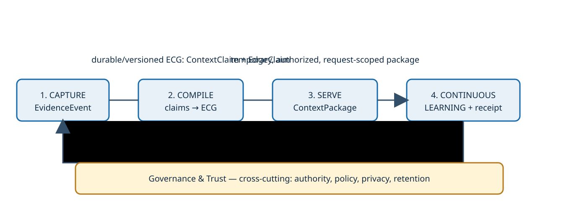

# Enterprise Context Store — reference architecture

> This is a technology-agnostic reference architecture. It names no vendor,
> database, model, or cloud. Inclusion of research sources is not endorsement.

## Flow

`EvidenceEvent → ContextClaim / EdgeClaim (canonical truth-bearing spine) → Topic / DecisionCase / semantic projections → ContextPackage → ContextDeliveryReceipt`

The raw ledger preserves evidence and append-only provenance/correction history, subject to
authorized retention, deletion, access-control, and privacy policy. Normalization produces
claims and evidence. Topic remains the durable agent-facing projection. Operational and decision evidence are typed Topic
facets. Schema-derived types are the baseline; conversation-derived candidate types require
human validation.

Graph traversal returns relation scopes, authoritative-system routes, and evidence identifiers;
it does not duplicate facts owned by systems of record. Vector retrieval selects permitted
evidence content within those scopes. Serving optimizes coverage under budget, penalizes
redundancy, supports deterministic retry, and may bypass traversal for direct Topic or
structured-intent lookup. Results include routes, permitted evidence, provenance/path IDs,
freshness, confidence, negative space, and unresolved contradictions.

Agents may directly access authoritative systems of record for facts the store does not own.
Governed feedback—assumptions, corrections, actions, write-backs, and outcomes—returns to
capture. The store serves agents; proactive notification belongs to a consuming agent.

## Accepted and candidate boundaries

`OperationalEpisode` and `DecisionEpisode` are candidate projections only: **not an accepted
richer Topic facets, proactive delta monitoring, and a minimum decision-context contract are
also candidates, not accepted architecture. The system captures observable evidence, rules,

privacy, human validation, and observability. Instance IDs remain references to authoritative
systems; source identity preservation and schema/type binding do not become MDM or cross-source
instance mastering.

# Lifecycle

The architecture follows **Capture → Compile → Serve → Continuous Learning**, with
**Governance & Trust** cross-cutting. The Context Store is the compiled product consumed at
the Serve boundary; it is not a separate lifecycle stage.
