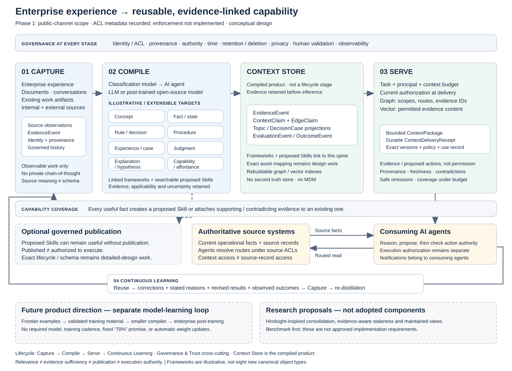

# Enterprise Context Store — reference architecture

> **Design-document refresh · 5 October 2026 · implementation: none.** This view reconciles
> the merged experience-distillation direction with the existing normative semantic contract.
> It describes intended responsibilities, not deployed functionality or a new build approval.
> Model names are optional implementation categories, not prescribed dependencies.

> **Publication scope:** technology-neutral framework, not a deployed runtime. The Phase 1
> public-channel-only scope and recording-only ACL boundary remain unchanged. References to
> current authorization, revocation, encryption, or privacy enforcement specify obligations for
> future implementations; they do not claim those mechanisms are implemented or authorize
> private/restricted ingestion. Existing accepted ADRs are not silently superseded.

## 1. Purpose and reading order

ECS distills **enterprise experience into reusable agent capabilities**. Capture, storage and
retrieval serve that purpose; ECS is not an agent-management platform or a replacement for
enterprise systems of record.

Read this architecture alongside the [experience-distillation direction](experience-distillation.md)
and the [context object and retrieval contract](context-object-and-retrieval-contract.md).
The latter preserves the normative semantic spine. Historical Phase 1 documents and ADRs are
not silently amended by this view. Research proposals and future product ideas are separated below.

## 2. End-to-end responsibilities

**Capture → Compile → Serve → Continuous Learning**, with **Governance & Trust** cross-cutting.

`Enterprise experience → Capture → Compile (producing the Context Store) → Serve → consuming AI agents`

`Reuse → corrections, stated rationale and observed outcomes → Capture → re-distillation`

The diagram expands compilation within the earlier Capture / Store / Serve framework. Its boxes
are logical responsibilities, not a required deployment topology, sequence of transactions,
new approved storage schema, or proof of implementation. Evidence is retained before and through
compilation; “Store” is not merely a last step after inference.

### Capture — retain observable experience and source identity

Capture existing internal and external enterprise material: documents, conversations, work
artifacts and observable attempts, corrections, approvals, stated rationale and outcomes where
available and authorized. Distinguish external sources structurally. Do not invent missing
rationale, conduct implicit elicitation, or capture private chain-of-thought.

Preserve evidence and provenance/correction history, subject to authorized access, retention,
deletion and privacy policy. `EvidenceEvent` represents source observations; normalization
retains source identity and provenance. Source schemas can bootstrap candidate business types,
but inferred business semantics require validation. Instance identifiers remain references to
authoritative systems: this is not MDM or cross-source instance mastering.

### Compile — classify, then distill into reusable frameworks

A **classification model** identifies relevant knowledge types, potentially several per source.
An **AI agent** then distills reusable frameworks and connects their outputs to evidence and
enterprise objects. **LLM or post-trained open-source model** are possible implementations;
no particular provider, model size, training recipe or threshold is required.

Eight illustrative, extensible compiler targets are:

| Framework | Question |
|---|---|
| Concept | What does this mean? |
| Fact and state | What is asserted, where and when? |
| Rule and decision | Under which conditions does something follow? |
| Procedure | How might work be performed? |
| Experience or case | What happened in this situation? |
| Judgment | How should this class of problem be assessed? |
| Explanation or hypothesis | Why might this happen? |
| Capability or affordance | What could be done with these objects? |

These are not eight mandated canonical object types. One episode can produce several linked
frameworks. A source assertion, inference, accepted rule and causal hypothesis have different
commitments. Model confidence does not confer authority.

A **proposed Skill** is a searchable capability hypothesis linking objects, possible actions,
intended outcomes, applicability and supporting or contradicting evidence. **Every useful fact
must either create a proposed Skill or attach as supporting/contradicting evidence to an existing
one.** Many facts can support one proposal; no one-Skill-per-fact rule is implied. Preserve other
facts without manufacturing a capability hypothesis.

### Context Store — compiled product, not a separate lifecycle stage

Compile publishes atomic claims into a durable, versioned Enterprise Context Graph (ECG).
Serve alone assembles temporary request-scoped packages and durable delivery receipts;
Compile never owns a durable ContextPackage. This is the existing
[ADR-0016 boundary](adr/0016-compile-publishes-ecg-serve-assembles-packages.md), not a new
publication-time decision. Governed Skill publication is a separate optional branch from
publication of canonical claims into the ECG.

The semantic flow remains:

`EvidenceEvent → ContextClaim / EdgeClaim → Topic or DecisionCase → ContextPackage + ContextDeliveryReceipt → EvaluationEvent / OutcomeEvent`

- `ContextClaim` is a governed atomic assertion. Consequential addressable relationships are
  `EdgeClaim`, not naked graph edges.
- `Topic` and versioned `DecisionCase` organize or project knowledge; **Topic is not the sole
  canonical unit**. `DecisionCase` preserves alternatives, criteria, assumptions, evidence,
  approvals, actions, outcomes and revisions.
- Frameworks and proposed Skills preserve links to that spine. Their exact schemas, lifecycle
  and storage mapping remain detailed-design work; this view creates no parallel canonical store.
- `EvaluationEvent` records subjective evaluation and `OutcomeEvent` objective results. Neither
  silently rewrites history; expert approval is not demonstrated business success.
- Graph/vector indexes, ranking views and other projections are rebuildable, not independent
  sources of truth or authority.

Evidence Capsules remain minimal. In regulated use, full evidence stays with the governed source
or records custodian; ECS retains an encrypted, access-controlled reference, integrity fingerprint
and provenance. Resolving the record requires current source authorization. Unavailable sources
remain explicit limitations, never fabricated evidence.

### Serve — assemble bounded, authorized context for a task

A consuming agent supplies a task and context budget. A derived `RetrievalPlan` may use graph
paths for relation scopes, authoritative-system routes and evidence identifiers, and vector
retrieval for permitted evidence within those scopes. Direct Topic or structured-intent lookup
may bypass graph traversal. Graphs and vectors do not duplicate source-owned operational facts
or define what is true.

Serve optimizes coverage under budget, limits redundancy and supports deterministic retry. It
returns a temporary, bounded `ContextPackage` with permitted evidence/frameworks, proposed Skills
as **supporting evidence or proposed actions**, source routes, provenance/path identifiers,
freshness, uncertainty, safe negative space and unresolved contradictions. Omission reporting
must not leak inaccessible knowledge.

The durable `ContextDeliveryReceipt` records exact object and representation versions, policy
decision, derivation/ranking versions, budget/truncation, safe omission categories and links to
resulting answers, decisions or actions. Receipts link externally to `DecisionCase`; they are not
intrinsic semantic nodes.

Current authorization uses the requesting/receiving `PrincipalRef` and applicable scoped
`AuthorityGrantRef`. A previous receipt or possession of context grants no future access;
revocation affects future delivery, with historical records still governed by retention/access
policy. Existing approved retrieval weights and profiles remain in the normative contract;
this diagram changes none of them. A runtime model cannot invent policy, weights or thresholds.

## 3. Consuming agents, source systems and action boundaries

Agents may follow ECS routes to authoritative source systems for current operational facts,
under source-system authorization. ECS does not take ownership of those records. Proactive
notification belongs to the consuming agent, not a new ECS notification subsystem.

Publication is an **optional governed branch**, not the mandatory destination of every proposed
Skill. A proposed action can draw on proposed or published knowledge. Publication, evidence
sufficiency and runtime execution authorization are distinct. This view does not resolve the
remaining detailed ECS/action-policy boundary or introduce a new execution engine.

## 4. Continuous learning without invented authority

Observable actions, write-backs, corrections, stated reasons, revised results and outcomes feed
back through Capture. Original episodes remain available to check generalizations. Missing
reasons stay missing; correlation is not causation. Retain disagreement rather than turning
repeated claims or popularity into truth. Governed feedback revisits reusable knowledge without
silently rewriting canonical history or granting action permission.

This is the **knowledge-learning loop**. It does not imply automatic model-weight updates.
The intended test is whether experience improves a different task and reduces repeated
correction, not simply how many Skills are emitted.

## 5. Governance across all stages

Identity/ACLs, provenance, authority, temporal validity, privacy, retention/deletion, human
validation and observability span evidence, compilation, derived outputs and delivery. Derived
frameworks and summaries must not expose restricted source information. Evidence sufficiency
is separate from action eligibility; a human-validation request is workflow state, not evidence.

## 6. Clearly separate future direction and research

**Future product direction — enterprise-adapted compiler.** Frontier compilation examples may
become validated training material for a smaller compiler, followed by enterprise-local
post-training from reviewed feedback. This is not deployed capability or a requirement for every
ECS instance. Training cadence, model choice, acceptance criteria and the separate evaluation
of compiler versions remain open. No “70%” quality promise is adopted. Current facts, policy and
permissions remain governed context, not authority encoded in model weights.

**Research proposals — Hindsight.** Incremental consolidation, evidence-aware staleness,
maintained framework views and source-to-abstraction retrieval are proposed enhancements to
benchmark. Hindsight is not an adopted component or approved integration.

**Still open.** Exact framework/proposed-Skill storage and retrieval contracts, bundle and
transaction design, ECS/action-policy boundary and any necessary superseding ADRs require
further design. Historical `OperationalEpisode` and `DecisionEpisode` names remain candidate
projections, not newly approved primitives; they are not synonyms for the normative
`DecisionCase`. Bootstrap-log scope, proactive delta monitoring and other earlier candidates
are not approved by this reconciliation.
